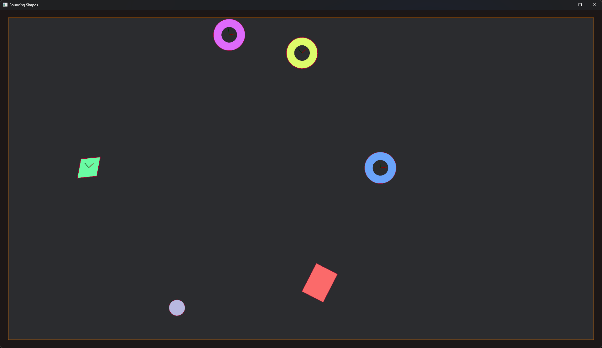
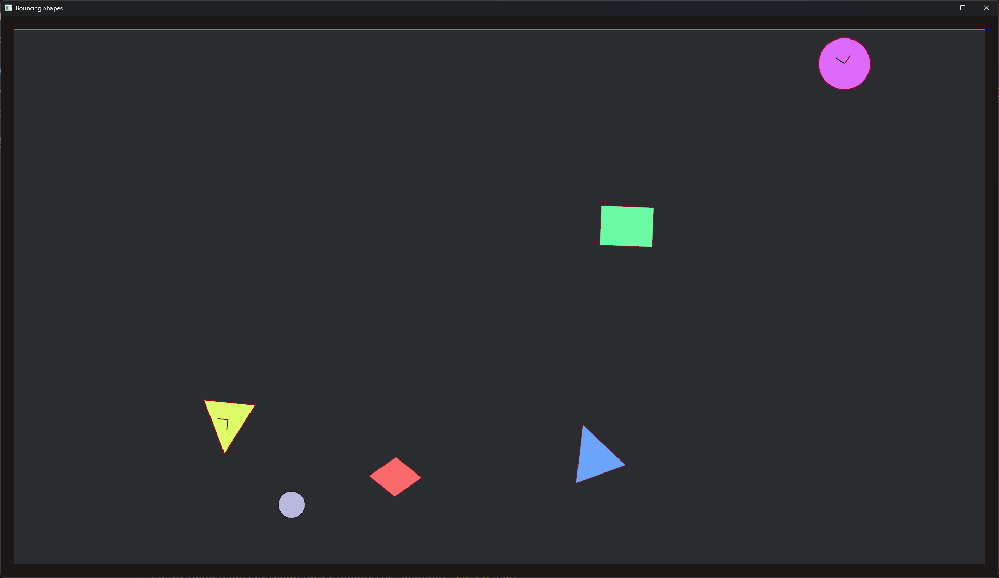

# Bevy Test Project

## Overview

This is a small test project using [Bevy](https://bevyengine.org/) and [Rapier](https://rapier.rs/) to get familiar with the engine and its Entity-Component-System (ECS) architecture.

## Goal

- Generate random shapes.
- Move them around randomly.
- Add a Player controller.
- Implement collision detection:
  - Shapes colliding with each other.
  - Shapes colliding with the walls.
- (Optional) Add visual effects using shaders on impact.

## Features

- Random shape generation
- Random movement for shapes
- WASD - Movement for player
- Collision detection via Rapier2d
- Shaders on impact (future enhancement)
